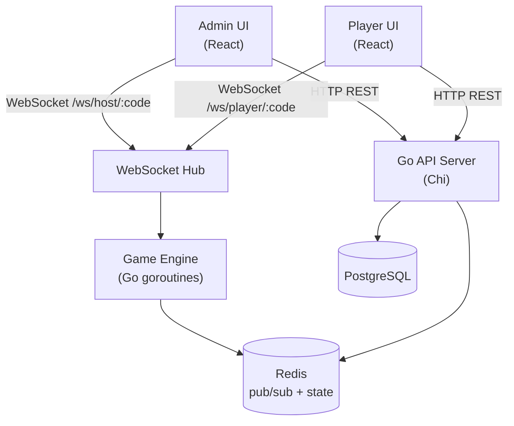

# Iftaroot

A real-time multiplayer quiz game platform — think Kahoot, built with Go and React.

## Stack

| Layer     | Technology                                   |
|-----------|----------------------------------------------|
| Backend   | Go 1.24, Chi router, gorilla/websocket       |
| Frontend  | React 19, TypeScript, Vite, Tailwind CSS v4  |
| Database  | PostgreSQL 16                                |
| Cache     | Redis 7                                      |
| Auth      | JWT (admin only)                             |
| Real-time | WebSockets                                   |
| Container | Docker + Docker Compose                      |

## Architecture



## Game Flow

1. Admin creates a quiz (questions + multiple-choice options)
2. Admin starts a session — gets a 6-digit room code
3. Players go to the join URL, enter the code + their name
4. Admin broadcasts questions one at a time with a countdown timer
5. When time expires or all players answer:
   - Players see "Correct / Incorrect" for 3 seconds (with points earned)
   - Admin screen shows the correct answer for 3 seconds
6. Leaderboard is shown to all (admin + players) after each question
7. After the final question, a podium (top 3) is displayed to everyone

### Scoring Algorithm

```
points = BasePoints × (1 - elapsed / timeLimit)
BasePoints = 1000, minimum = 0
```

Faster correct answers earn more points. Wrong answers earn 0.

## Quick Start (Docker)

```bash
# 1. Copy env vars
cp .env.example .env

# 2. Start everything (backend, frontend, postgres, redis)
docker compose up --build

# 3. Open in browser
#    Admin:  http://localhost:5173
#    Player: http://localhost:5173/join
```

## Development Commands

All commands run inside Docker (or locally with the right tooling installed).

### Backend

```bash
# Run tests
docker compose exec backend go test ./...

# Run linter
docker compose exec backend golangci-lint run

# Apply migrations (auto-runs on startup)
# Manual: docker compose exec backend go run cmd/migrate/main.go
```

### Frontend

```bash
# Run tests
docker compose exec frontend pnpm test

# Lint
docker compose exec frontend pnpm lint

# Type check
docker compose exec frontend pnpm exec tsc --noEmit
```

## Project Structure

```
Iftaroot/
├── backend/
│   ├── cmd/server/         # Entry point
│   ├── internal/
│   │   ├── config/         # Env config loader
│   │   ├── db/             # DB + Redis connection, migrations
│   │   ├── game/           # Scoring algorithm, game engine
│   │   ├── handlers/       # HTTP + WebSocket handlers
│   │   ├── hub/            # WebSocket hub (room management)
│   │   ├── middleware/     # JWT auth middleware
│   │   └── models/         # Domain models
│   └── migrations/         # SQL migration files
├── frontend/
│   └── src/
│       ├── api/            # Axios client + React Query
│       ├── components/     # Reusable UI components
│       ├── hooks/          # Custom React hooks (useWebSocket etc.)
│       ├── pages/          # Route-level page components
│       ├── stores/         # Zustand state stores
│       └── types/          # TypeScript type definitions
├── Dockerfile.backend
├── Dockerfile.frontend
├── docker-compose.yml
└── .github/workflows/ci.yml
```

## Contributing

1. Pick an issue and assign yourself
2. Branch: `feat/<issue-number>-<short-description>`
3. Implement + write tests
4. Verify CI passes locally: `docker compose build && docker compose up -d`
5. Open a PR — CI must pass before merge
6. No direct commits to `main`

## WebSocket API

### Host connects to
```
ws://host/ws/host/:sessionCode
Authorization: Bearer <jwt>
```

### Player connects to
```
ws://host/ws/player/:sessionCode?player_id=<id>&name=<name>
```

### Message types (both directions)
| Type              | Direction       | Description                            |
|-------------------|-----------------|----------------------------------------|
| `player_joined`   | server → all    | New player joined the lobby            |
| `player_left`     | server → all    | Player disconnected                    |
| `game_started`    | server → all    | Game has started                       |
| `question`        | server → all    | New question with options + timer      |
| `answer_submitted`| client → server | Player submits their answer            |
| `answer_reveal`   | server → all    | Correct answer revealed + points       |
| `leaderboard`     | server → all    | Updated leaderboard after question     |
| `game_over`       | server → all    | All questions complete                 |
| `podium`          | server → all    | Top 3 players podium                   |
